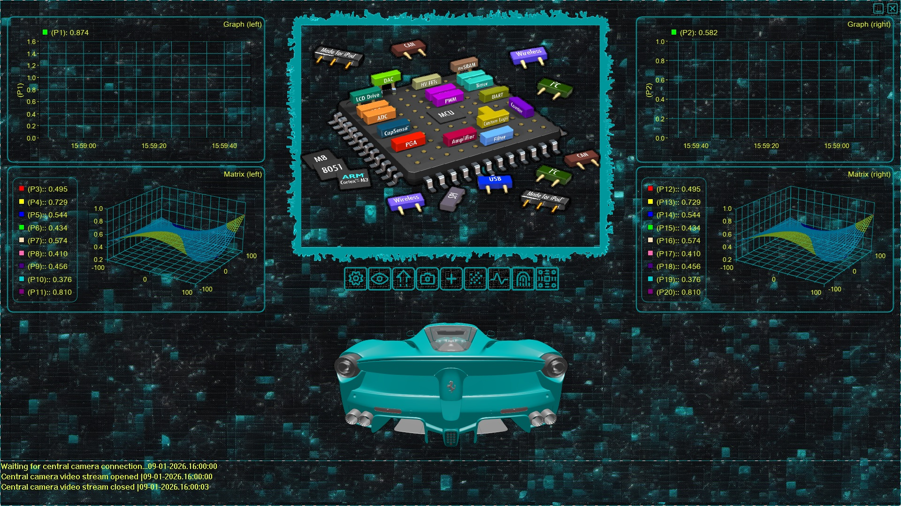
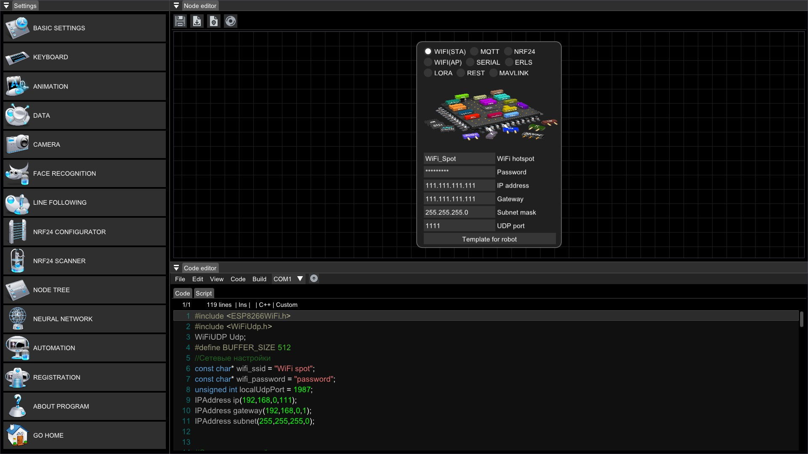
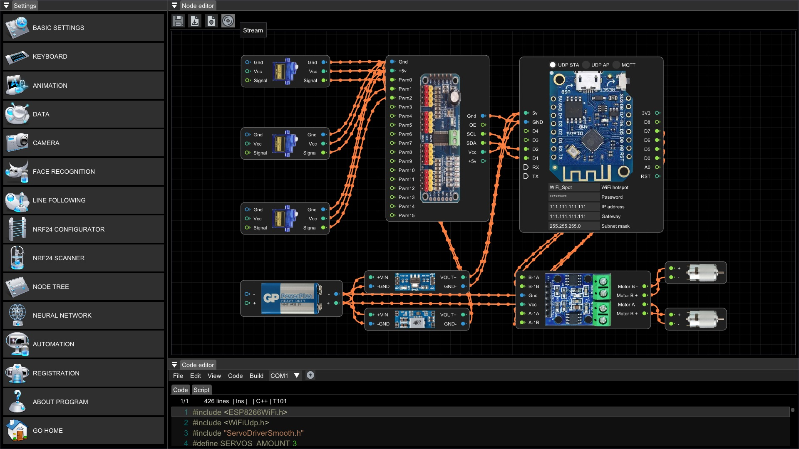
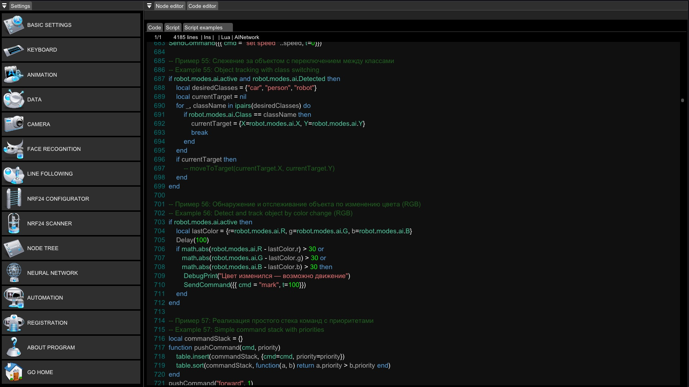

# RoboX: The Ultimate Software Universe for DIY Robotics

Welcome to the world of **RoboX**, where the boundaries between your imagination and robotic reality dissolve. RoboX is not merely a program; it is a comprehensive, professional-grade ecosystem meticulously engineered for creators, engineers, educators, and visionaries. Our mission is to democratize advanced robotics by providing a singular, powerful platform that unifies control, vision, and intelligence.

**One Platform. Infinite Possibilities.**

|  |  |
|:---:|:---:|
| *Main page* | *Settings page* |
|  |  |
| *Project editor* | *Script editor* |

---

## Core Features

### A Universal Command Center for Your Robotic Fleet
RoboX is the universal translator and commander for the fragmented landscape of microcontrollers, offering native support for:
*   **Arduino & compatibles** – The cornerstone of DIY electronics.
*   **Raspberry Pi, Orange Pi, Banana Pi** – The full power of Linux-based robotics.
*   **LEGO Mindstorms EV3** – Bringing educational robotics to a new level.
*   **BeagleBone and other analogues** – For industrial-grade prototyping.

> No more juggling multiple IDEs. RoboX is your one-stop command bridge to them all.

### Unleash the Power of Intelligent Vision
Our deeply integrated OpenCV computer vision engine transforms your robot into a perceptive entity:
*   **Human-Centric Interaction**: Face recognition paired with voice feedback.
*   **Environmental Intelligence**: QR code recognition, identification of 80+ objects (COCO model), detection of GHS hazard pictograms.
*   **Autonomous Guidance**: Precision line-following algorithms.
*   **Custom Intelligence**: Train and integrate your own custom vision models.

### Unmatched Connectivity and Telemetry
Control and monitor your creations through a wide array of interfaces: **Wi-Fi, MQTT, nRF24L01, LoRa, MavLink, REST API, Serial (UART/USB)**, and more.
*   **Comprehensive Logging**: Log every command, sensor reading, and event.
*   **Multi-Camera Streaming**: Stream live video from up to **3 cameras** simultaneously (RTSP, HTTP, FPV).
*   **Live Data Visualization**: Monitor vital signs in real-time with an online trend visualizer for up to 20 sensors.

### From Prototype to Perfection: An Integrated Development Sanctuary
Accelerate your development cycle with built-in tools:
*   **Lua Script Editor for Automation**: Script complex, conditional robot behaviors.
*   **Project Configurator & Arduino Compiler**: Flash your Arduino sketches directly from RoboX.
*   **Ready-Made DIY Project Templates**: Jumpstart your journey with proven templates.
*   **nRF24L01 Radio Channel Manager**: Configure and debug your wireless mesh networks.

### Immerse Yourself in the Control Experience
*   **Mission Recording**: Record the entire management process—video, controls, and telemetry.
*   **Universal "Custom" Template**: Map your robot's controls to a keyboard, gamepad, or on-screen interface in minutes.
*   **3D Model Visualization**: See a real-time animated 3D representation of your robot's movement and orientation.

---

## Why Choose RoboX?
RoboX is built on the philosophy that **powerful tools should uncomplicate complexity**. We remove the tedious hurdles of integration, compilation, and protocol management, freeing you to focus on what truly matters: **innovation, experimentation, and creation**.

Whether you are a student, researcher, or hobbyist, RoboX provides the industrial-grade software foundation for your projects.

---

## Contact & Links
*   **Official Website & Blog**: [https://roboxsoftware.wordpress.com/](https://roboxsoftware.wordpress.com/)
*   **Contact Email**: techinfo.robox@gmail.com
*   **Community Forum**: https://github.com/RoboXSoftware/RoboX/discussions
---

> **RoboX: One Platform. Infinite Possibilities.**
